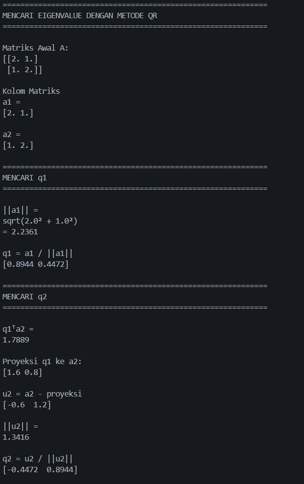
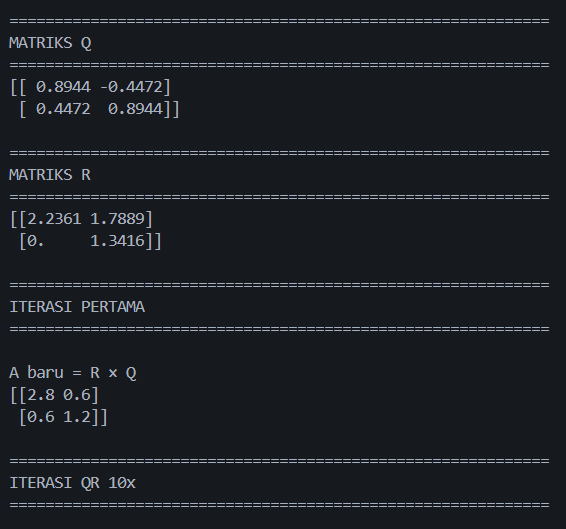
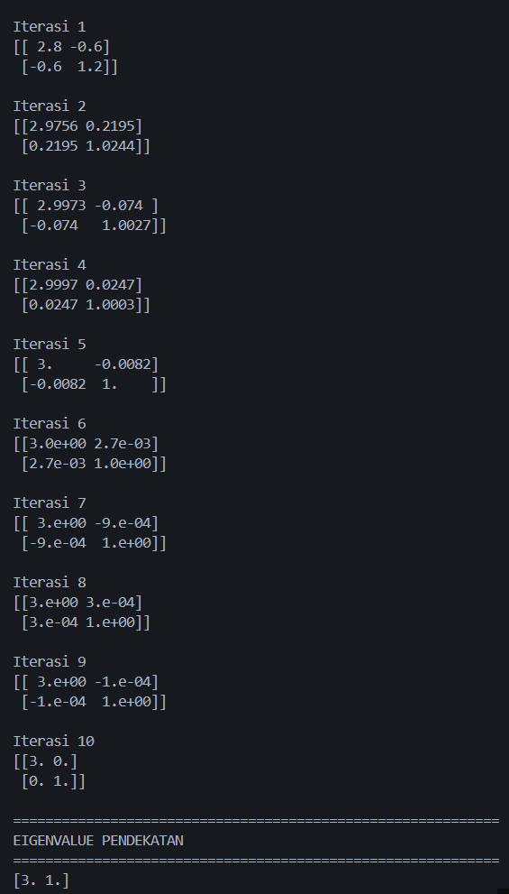

# Eigenvalue & Eigenvector

### Matriks Awal

Diketahui matriks:

$$
A=
\begin{bmatrix}
2 & 1\\
1 & 2
\end{bmatrix}
$$

### Membentuk Kolom Matriks

Kolom-kolom matriks A:

$$
a_1=
\begin{bmatrix}
2\\
1
\end{bmatrix}
\qquad
a_2=
\begin{bmatrix}
1\\
2
\end{bmatrix}
$$

### Mencari Matriks Q dengan Gram-Schmidt

#### Langkah 1 — Mencari $q_1$

Rumus:

$$
q_1 = \frac{a_1}{||a_1||}
$$

Hitung norm (panjang vektor):

$$
||a_1|| = \sqrt{2^2+1^2} = \sqrt{5}
$$

Maka:

$$
q_1 = \frac{1}{\sqrt5}
\begin{bmatrix}
2\\
1
\end{bmatrix}
$$

Hasil:

$$
q_1 = \begin{bmatrix} 0.8944 \\ 0.4472\end{bmatrix}
$$

Karena:

$$
\frac{2}{\sqrt5} = 0.8944
$$

$$
\frac{1}{\sqrt5} = 0.4472
$$

---

#### Langkah 2 — Mencari $q_2$
##### Mencari Proyeksi

Rumus proyeksi:

$$
\text{proj}_{q_1}(a_2) = (q_1^Ta_2)q_1
$$

Hitung dot product:

$$
q_1^Ta_2 = (0.8944)(1) +(0.4472)(2) = 1.7888
$$

Maka:

$$
\text{proj}_{q_1}(a_2) = 1.7888
\begin{bmatrix}
0.8944\\
0.4472
\end{bmatrix}
$$

Hasil:

$$
\text{proj}_{q_1}(a_2) =
\begin{bmatrix}
1.6\\
0.8
\end{bmatrix}
$$

---

#### Mencari Vektor Ortogonal

$$
u_2 = a_2 - \text{proj}_{q_1}(a_2)
$$

$$
u_2 = 
\begin{bmatrix}
1\\
2
\end{bmatrix} - \begin{bmatrix}
1.6\\
0.8
\end{bmatrix} = \begin{bmatrix}
-0.6\\
1.2
\end{bmatrix}
$$

---

##### Normalisasi $u_2$

Hitung norm:

$$
||u_2|| = \sqrt{
(-0.6)^2+(1.2)^2}= 1.3416
$$

Rumus:

$$
q_2 = \frac{u_2}{||u_2||}
$$

Hasil:

$$
q_2 =
\begin{bmatrix}
-0.4472\\
0.8944
\end{bmatrix}
$$

### Membentuk Matriks Q

$$
Q=
[q_1 \quad q_2]
$$

$$
Q=
\begin{bmatrix}
0.8944 & -0.4472\\
0.4472 & 0.8944
\end{bmatrix}
$$

### Mencari Matriks R

Rumus:

$$
R = Q^TA
$$

Transpose dari matriks Q:

$$
Q^T=
\begin{bmatrix}
0.8944 & 0.4472\\
-0.4472 & 0.8944
\end{bmatrix}
$$

Matriks A:

$$
A=
\begin{bmatrix}
2 & 1\\
1 & 2
\end{bmatrix}
$$

Maka:

$$
R=
\begin{bmatrix}
0.8944 & 0.4472\\
-0.4472 & 0.8944
\end{bmatrix}
\begin{bmatrix}
2 & 1\\
1 & 2
\end{bmatrix}
$$

#### Menghitung Nilai dalam Matriks R

#### Elemen $r_{11}$

Baris 1 × Kolom 1:

$$
r_{11} = (0.8944)(2) + (0.4472)(1)
$$

$$ = 1.7888+0.4472 = 2.2360
$$

#### Elemen $r_{12}$

Baris 1 × Kolom 2:

$$
r_{12} = (0.8944)(1) + (0.4472)(2)
$$

$$ = 0.8944+0.8944 = 1.7888
$$

#### Elemen $r_{21}$

Baris 2 × Kolom 1:

$$
r_{21}
= (-0.4472)(2)
+
(0.8944)(1)
$$

$$
= -0.8944+0.8944 = 0
$$

#### Elemen $r_{22}$

Baris 2 × Kolom 2:

$$
r_{22} = (-0.4472)(1)
+
(0.8944)(2)
$$

$$
= -0.4472+1.7888 = 1.3416
$$

### Hasil Matriks R

$$
R=
\begin{bmatrix}
2.2360 & 1.7888\\
0 & 1.3416
\end{bmatrix}
$$

$\quad\quad$
---

### Contoh Output Program Python:
<a href="https://drive.google.com/file/d/1LsaL8AHaTn3TXiCp9sLdqHjpiNqUmKp6/view?usp=drive_link">Download Kode Script Python</a>

